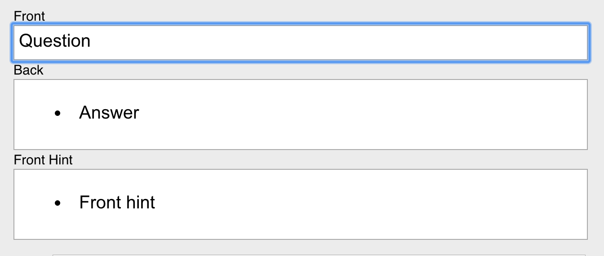
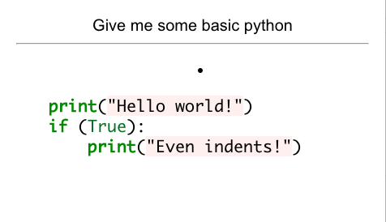

# Org or Text file Syntax

* This section looks at how org or text files should be structured
* Each org file will be converted into its own deck in Anki
    * The name of the deck will be the name of the file

0. [Basic syntax](#basic-syntax) 
1. [Card tags](#note-tags)
2. [File types for organisation](#file-types-for-organisation) 
3. [Adding images](#adding-images) 
4. [HTML code and LaTeX](#html-code-and-latex)
5. [Supported parameters](#supported-parameters) 
6. [Supported Note Models](#supported-note-models)
7. [Code Highlighting](#code-highlighting)

## Basic syntax

Question lines start with a single asterisk.
```org
* Answer
```
Answer lines start with a double asterisk
```org
** Answer
```
Comment lines start with a \#
```org
# This is a comment
```
Arguments or paremeters are passed via comments using an equals
```org
# type=sometype
```
Empty lines are ignored

### Basic example

```org
# Line comments
# fileType=test
* Question
** Answer
```

## Note tags

Tags can be added via the tags key work in paramters. Each comma seperated item after the = is considered a seperated tag.
Example syntax:
`tags=1,2,3` => Tags card with `1`, `2` and `3` 


Adding the tags `1`, `2` and `3` to a single card:
```org
* Question
# tags=1,2,3
** Answer
```


### More on parameters

* Parameters set at the top of the file are known as global parameters.
    * Global parameters are inherited by all questions / decks. 
    * Global parameters can be overwritten with parameters placed directly in the question
* To set a question for a parameter just set the value underneath the answer

* Here is an example:
    * The global parameter type is used to set the card type for all question below
        * It is set to Basic.
    * The user set the second question as a different type of card
        * It is set to => type=Basic (and reversed card)

```org
# Basic Example
# type=Basic

* Question
** Answer

* Second Question
# type=Basic (and reversed card)
** Second Answer
```

## File types for organisation

Users may want to organise their files in a specific ways. 

Currently five differnet file types are supported.

* [Basic file types (Default)](#basic-org-file-syntax)
* [Topics file type](#topics-file-syntax)
* [Organised file type](#Organised-File-syntax)
* [FlatTopics file type](#FlatTopics-file-syntax)
* [OrganisedFlatFile file type](#OrganisedFlatFile-file-syntax)

### Basic org file syntax

* Sample answer and question in org or txt file
* This is the default

 ```org
 * What is the capital of Ireland?
 ** Dublin
 ```

* This will produce the following 1 Anki note in the same deck

```org
What is the capital of Ireland?
_______________________________________________________________________
Dublin
```
 
### Topics file syntax

* Each topic will be turned into its own subdeck. 
    * The name of this deck is given by the first line. E.G Capitals cities and Spoken languages.
* Allows for a group of related topics to be managed in a single file.

* Sample answer and questions for topics org or txt file.

 ```org
 #fileType = topics

 * Capital cities
 ** What is the capital of Ireland?
 *** Dublin
 
 * Spoken languages
 ** What are the main spoken languages in Ireland?
 *** English
 *** Irish
 ```

* This will produce the following 2 Anki note in separate decks

```org
What is the capital of Ireland?
_______________________________________________________________________
Dublin
```

```org
What are the main spoken languages in Ireland?
_______________________________________________________________________
English
Irish
```

### Organised File syntax

* All topics are combined into the same deck to be uploaded to Anki
    * Top level bullet points are ignored
    * Normally used as metadata the user has to organise the information

* Sample answer and questions for flatTopics org or txt file.

 ```org
 #fileType = organisedFile

* Chapter 1
** First main rule of scalability?
*** Each server behind load balancer

* Chapter 2
** What is the main purpose of the factory pattern?
*** Allow reference to objects via an interface
 ```

* This will produce the following 2 Anki notes in the same deck

```org
First main rule of scalability?
_______________________________________________________________________
Each server behind load balancer
```

```org
What is the main purpose of the factory pattern?
_______________________________________________________________________
Allow reference to objects via an interface
```

### FlatTopics file syntax

* All topics are combined into the same deck to be uploaded to Anki
    * The name of each topic is added to the top of each card.
    * Allows user to include general data in each question

* Sample answer and questions for flatTopics org or txt file.

 ```org
 #fileType = flatTopics

 * Capital cities
 ** What is the capital of Ireland?
 *** Dublin

 * Spoken languages
 ** What are the main spoken languages in Ireland?
 *** English
 *** Irish
 ```

* This will produce the following 2 Anki notes in the same deck

```org
Capital Cities
What is the capital of Ireland?
_______________________________________________________________________
Dublin
```

```org
Spoken Languages
What are the main spoken languages in Ireland
_______________________________________________________________________
English
Irish
```

### OrganisedFlatFile file syntax

 * All topics are combined into the same deck to be uploaded to Anki
    * First level bullet points are added as metadata to each question
    * The second level of bullet points are used for data organisation and are ignored

 * Sample answer and questions for flatTopics org or txt file.

```org
 #fileType = organisedFlatFile

* Systems design primer
** Scalability intro blog
*** First main rule of scalability?
**** Each server behind load balancer

* Programming design patterns (online version)
** Factory pattern
*** What is the main purpose of the factory pattern? (2)
**** To allow object creation without exposing the creation logic to client
**** Allow reference to objects via an interface
```

 * This will produce the following 2 Anki notes in the same deck

```org
Systems design primer
First main rule of scalability?
_______________________________________________________________________
Dublin
```

```org
Programming design patterns (online version)
What is the main purpose of the factory pattern? (2)
_______________________________________________________________________
To allow object creation without exposing the creation logic to client
Allow reference to objects via an interface
```
## Adding images

* You can add an image as one of your answers by correctly referencing as follows
	* Note: The image path should be relative to the file location or absolute
	* The file will name will not change on upload. 
		* In this case => "composite pattern.png"
		* This could lead to a conflict on Anki if files are named badly

* Check out the examples folder for a sample

```org
* What does the UML diagram for the compsite pattern look like?
** Image is displayed below
** [images_folder/composite pattern.png]
```

## Supported parameters

* Each line must start with a hashtag

```org 
# type=Basic
# type = Basic
```

* Currently supported parameters are questions type

### File type => ```fileType```
    * Org or txt files will default to type basic.
    * If you want to use a topics layout this must be specified at the top of the file.

```org
# Comment line
# fileType=topics

* Topics 1
** Questions 1
*** Answer 1
```

### Anki Note type => ```type```
    * Used to set the type of the Anki note.
    * Default value is Basic
    * This is case sensitive and can be used to set any card type

```org
# type=Basic
# type=Basic (and reversed card)
```

For more information on support models => [Supported Note Models](#supported-note-models)

### HTML list types => ```list```

    * Answers on cards are displayed as list
    * By default this will use an unordered

#### Unordered list (Default)
```org
# list=ul
# list=unordered
```

Produces a card like below

```org
Question
_______________________________________________________________________
* Answer 1
* Answer 2
```

#### Ordered list 
```org
# list=ol
# list=ordered
```

Produces a card like below

```org
Question
_______________________________________________________________________
1. Answer 1
2. Answer 2
```

#### No list 
```org
# list=false
# list=None
```

Produces a card like below

```org
Question
_______________________________________________________________________
Answer 1
Answer 2
```

### Note fields => ```fieldName```

Can be used to create a card with extra named fields such as a Hint for the question.
You are also required to set the note type. 

Assumptions on default:

* Question `fieldName` is Front
* Answer `fieldName` is Back 

```
* Question
# type=Hint Card
** Answer
# fieldName=Front Hint
** Front hint
```

Example Card



## HTML code and LaTeX

* By default both HTML and Latex should be supported as they are in Anki

### HTML

* HTML formatting will be displayed as expected in Anki 
    * An example is show below

```org
* Question
** <b>Bold answer</b>
```

### LaTeX

* The best source on how to use LaTeX is the official documentation.
    * [Anki Documentation on Latex use](https://apps.ankiweb.net/docs/manual.html#latex-support)
* LaTeX added in any of the below formats will be rendered by Anki

Anki supports 3 different types of LaTeX formatting

* General LaTeX

```latex
[latex]...User specific latex..[/latex]
```

* Math Latex

```latex
[latex]\begin{math}...user specific latex...\end{math}[/latex]
```

This is shortened as follows

```org
[$]...[/$]
```

* DisplayMath LaTeX

```latex
[latex]\begin{math}...user specific latex...\end{math}[/latex]
```

This is shortened as follows

```org
[$$]...user specific latex...[/$$]
```

### Parameter inheritance

* Questions and decks will inhert parameters from parent Decks
* Parameters inhereted will not override existing parameters.

### Supported note models

The following assumption is made in each case except Cloze:

* Question `fieldName` is Front.
* Answers `fieldName` is Back.
* A question must have either code or an answer to be valid.


By default the following model types are supported with examples:

* Basic

```org
* Basic Question
** Basic Answer
```

* Basic (and reversed card)

```org
* Basic and reversed cards question
# type = Basic (and reversed card)
** Answer
```

* Basic (optional reversed card)

```org
* Basic and reversed cards question
# type = Basic (and reversed card)
** Answer
# fieldName=Add Reverse
** If card should be reversed 
```


* Cloze
    * Cloze in can not be set for all cards in a deck and must be specified for each card
    * Two example are below

```org
* When was Dublin founded {{c1::1204}}
# type=Cloze
** Extra Info

* When was Germany founded {{c1::1204}}
# type=Cloze
```


## Code Highlighting

This parser support code highlighting using the Pygments library.

[Supported Languages](http://pygments.org/languages/)

Example syntax below:

```org
	* Give me some basic python
	```python3
	print("Hello world!")

	if (True):
		print("Even indents!")
	```
```

This would produce the following card:


